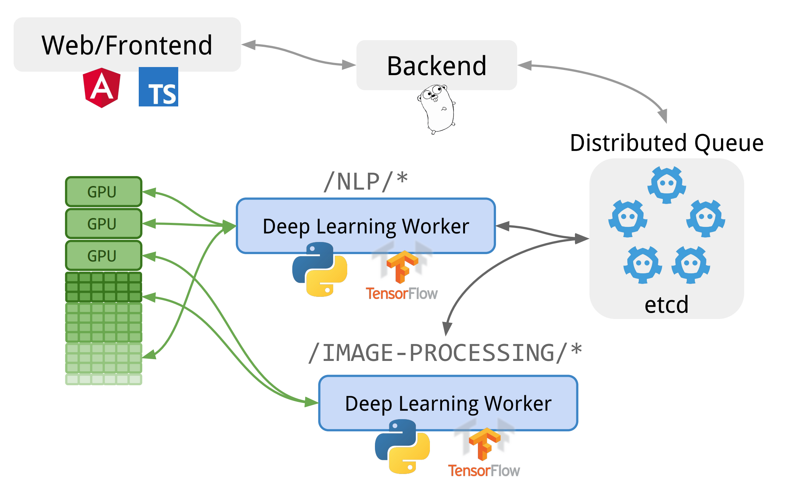
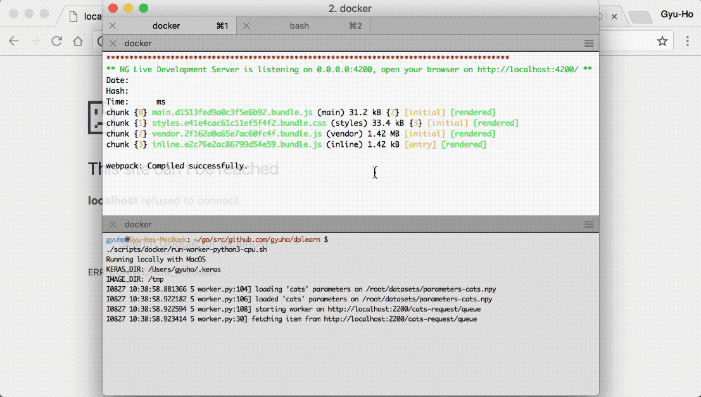

## dplearn

[](https://goreportcard.com/report/github.com/gyuho/dplearn)
[](https://travis-ci.org/gyuho/dplearn)
[](https://semaphoreci.com/gyuho/dplearn)
[](https://godoc.org/github.com/gyuho/etcdlabs)

Learn Deep Learning The Hard Way.

It is a set of small projects on [Deep Learning](https://en.wikipedia.org/wiki/Deep_learning).

<br><br>

- [System Overview](#system-overview)
- [Cats vs. Non-Cat](#cats-vs-non-cat)
- [Workflow](#workflow)
- [Other](#other)

<br><br>

### System Overview



- [`frontend`](https://github.com/gyuho/dplearn/tree/master/frontend) implements user-facing UI, sends user requests to [`backend/*`](https://github.com/gyuho/dplearn/tree/master/backend).
- [`backend/web`](https://github.com/gyuho/dplearn/tree/master/backend/web) schedules user requests on [`pkg/etcd-queue`](https://github.com/gyuho/dplearn/tree/master/pkg/etcd-queue).
- [`backend/worker`](https://github.com/gyuho/dplearn/tree/master/backend/worker) processes jobs from queue, and writes back the results.
- Data serialization from `frontend` to `backend/web` is defined in [`backend/web.Request`](https://github.com/gyuho/dplearn/blob/master/backend/web/handler.go) and [`frontend/app/request.service.Request`](https://github.com/gyuho/dplearn/blob/master/frontend/app/request.service.ts).
- Data serialization from `backend/web` to `frontend` is defined in [`pkg/etcd-queue.Item`](https://github.com/gyuho/dplearn/blob/master/pkg/etcd-queue/item.go) and [`frontend/app/request.service.Item`](https://github.com/gyuho/dplearn/blob/master/frontend/app/request.service.ts).
- Data serialization between `backend/web` and `backend/worker` is defined in [`pkg/etcd-queue.Item`](https://github.com/gyuho/dplearn/blob/master/pkg/etcd-queue/item.go) and [`backend/worker/worker.py`](https://github.com/gyuho/dplearn/blob/master/backend/worker/worker.py).

Notes:

- **Why is the queue service needed?** To process concurrent users requests. Since worker has limited resources, requests has to be serialized into the queue.
- **Why Go?** To natively use [`embedded etcd`](https://github.com/coreos/etcd/tree/master/embed).
- **Why etcd?** For [etcd Watch API](https://godoc.org/github.com/coreos/etcd/clientv3#Watcher). `pkg/etcd-queue` uses Watch to stream updates to `backend/worker` and `frontend`. This minimizes TCP socket creation and slow TCP starts (e.g. streaming vs. polling).

This is a *proof-of-concept*. In production, I would use: [Tensorflow/serving](https://tensorflow.github.io/serving/) to serve the pre-trained models, distributed [`etcd`](https://github.com/coreos/etcd) for higher availability.

[↑ top](#dplearn)
<br><br>


### Cats vs. Non-Cat

To train `cats` 5-layer Deep Neural Network model:

```bash
DATASETS_DIR=./datasets \
  CATS_PARAM_PATH=./datasets/parameters-cats.npy \
  python3 -m unittest backend.worker.cats.model_test
```

This persists trained model parameters on disk that can be loaded by workers later.



Try other cat photos:

- https://static.pexels.com/photos/127028/pexels-photo-127028.jpeg
- https://static.pexels.com/photos/126407/pexels-photo-126407.jpeg
- https://static.pexels.com/photos/54632/cat-animal-eyes-grey-54632.jpeg

[↑ top](#dplearn)
<br><br>


### Workflow

To run application (backend, web UI) locally, on http://localhost:4200:

```bash
./scripts/docker/run-app.sh
./scripts/docker/run-worker-python3-cpu.sh

<<COMMENT
# to serve on port :80
./scripts/docker/run-reverse-proxy.sh
COMMENT
```

To run tests:

```bash
./scripts/tests/frontend.sh
./scripts/tests/go.sh

go install -v ./cmd/backend-web-server

DATASETS_DIR=./datasets \
  CATS_PARAM_PATH=./datasets/parameters-cats.npy \
  ETCD_EXEC=/opt/bin/etcd \
  SERVER_EXEC=${GOPATH}/bin/backend-web-server \
  ./scripts/tests/python3.sh
```

To run [IPython Notebook](https://ipython.org) locally, on http://localhost:8888/tree:

```bash
./scripts/docker/run-ipython-python3-cpu.sh
./scripts/docker/run-ipython-python3-gpu.sh
./scripts/docker/run-r.sh
```

To deploy `dplearn` and IPython Notebook on Google Cloud Platform CPU or GPU:

```bash
GCP_KEY_PATH=/etc/gcp-key-dplearn.json ./scripts/gcp/ubuntu-python3-cpu.gcp.sh
GCP_KEY_PATH=/etc/gcp-key-dplearn.json ./scripts/gcp/ubuntu-python3-gpu.gcp.sh

# create a Google Cloud Platform Compute Engine VM with a start-up script
# to provision GPU, init system, reverse proxy, and others
# (see ./scripts/gcp/ubuntu-python3-gpu.ansible.sh for more detail)
```

[↑ top](#dplearn)
<br><br>


### Other

To update dependencies:

```bash
./scripts/dep/go.sh
./scripts/dep/frontend.sh
```

To update [`Dockerfile`](./dockerfiles):

```bash
# update 'container.yaml' and then
./scripts/docker/gen.sh
```

To build Docker container images:

```bash
./scripts/docker/build-app.sh
./scripts/docker/build-python3-cpu.sh
./scripts/docker/build-python3-gpu.sh
./scripts/docker/build-r.sh
./scripts/docker/build-reverse-proxy.sh
```

[↑ top](#dplearn)
<br><br>
