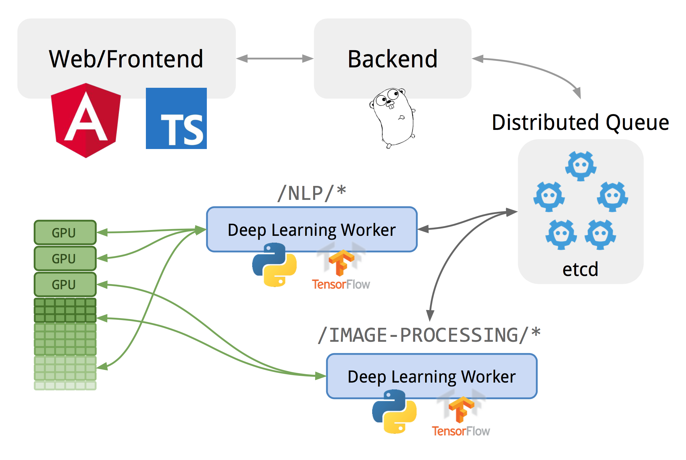

## deephardway

[](https://travis-ci.org/gyuho/deephardway)
[](https://semaphoreci.com/gyuho/deephardway)
[](https://godoc.org/github.com/gyuho/deephardwayhardway)

Learn Deep Learning The Hard Way.

It is a set of small projects on [Deep Learning](https://en.wikipedia.org/wiki/Deep_learning).


### System Overview



- [`frontend`](https://github.com/gyuho/deephardway/tree/master/frontend) implements user-facing UI, sends user requests to [`backend/*`](https://github.com/gyuho/deephardway/tree/master/backend).
- [`backend/web`](https://github.com/gyuho/deephardway/tree/master/backend/web) schedules user requests on [`pkg/etcd-queue`](https://github.com/gyuho/deephardway/tree/master/pkg/etcd-queue).
- [`backend/worker`](https://github.com/gyuho/deephardway/tree/master/backend/worker) processes jobs from queue, and writes back the results.
- `backend/web` gets notified with [Watch API](https://godoc.org/github.com/coreos/etcd/clientv3#Watcher) when the job is done, and returns results back to users.
- Data serialization from `frontend` to `backend/web` is defined in [`backend/web.Request`](https://github.com/gyuho/deephardway/blob/master/backend/web/handler.go) and [`frontend/app/request.component.Request`](https://github.com/gyuho/deephardway/blob/master/frontend/app/request.component.ts).
- Data serialization from `backend/web` to `frontend` is defined in [`pkg/etcd-queue.Item`](https://github.com/gyuho/deephardway/blob/master/pkg/etcd-queue/queue.go) and [`frontend/app/request.component.Item`](https://github.com/gyuho/deephardway/blob/master/frontend/app/request.component.ts).
- Data serialization between `backend/web` and `backend/worker` is defined in [`pkg/etcd-queue.Item`](https://github.com/gyuho/deephardway/blob/master/pkg/etcd-queue/queue.go) and [`backend/worker/worker.py`](https://github.com/gyuho/deephardway/blob/master/backend/worker/worker.py).

Notes:

- **Why is the queue service needed?** To process concurrent users requests. Worker has limited resources. Requests can be serialized into the queue, so that worker performance is maximized for each task.
- **Why Go?** To natively use [`embedded etcd`](https://github.com/coreos/etcd/tree/master/embed).
- **Why etcd?** It has *really great* [Watch API implementation](https://godoc.org/github.com/coreos/etcd/clientv3#Watcher)! Highly recommend [`etcd`](https://github.com/coreos/etcd)! `pkg/etcd-queue` uses Watch API to stream updates to `backend/worker` and `frontend`. This minimizes TCP socket creation and slow TCP starts (e.g. streaming vs. polling). *TODO: use streaming to broadcast more fine-grained job status.*
- **How is this deployed?** everything is run in *one container*, since I have limited budget on public serving. In production, [`etcd`](https://github.com/coreos/etcd) can be distributed for higher availability, and [Tensorflow/serving](https://tensorflow.github.io/serving/) can serve the pre-trained models.


### Development Workflow

To update dependencies:

```bash
# update 'Gopkg.toml',
# this is necessary, whether run with/without container
# since docker build copies 'vendor' directory to the container image
./scripts/dep/go-dep.sh

# update 'cmd/gen-package-json' and then
./scripts/dep/frontend.sh
```

To update [`Dockerfile`](Dockerfile):

```bash
# after updating '*/Dockerfile.yaml', 'cmd/gen-dockerfiles'
./scripts/docker/gen.sh
```

To build Docker container image:

```bash
./scripts/docker/build-cpu.sh
./scripts/docker/build-gpu.sh
```

To run tests:

```bash
./scripts/tests/frontend.sh
./scripts/tests/go.sh
ETCD_EXEC=/etcd ./scripts/tests/python.sh

# run tests inside container
./scripts/docker/tests-cpu.sh
./scripts/docker/tests-gpu.sh
```

To run [IPython Notebook](https://ipython.org/notebook.html) locally:

```bash
./scripts/docker/ipython-cpu.sh
./scripts/docker/ipython-gpu.sh

# Add 'source activate r' to run with R kernel.
# It uses Tensorflow base image, so need to
# manually configure the R Anaconda workspace.
ACTIVATE_COMMAND="source activate r &&" ./scripts/docker/ipython-cpu.sh
```

To run `deephardway` application (backend, web UI, worker) locally:

```bash
./scripts/docker/deephardway-cpu.sh
./scripts/docker/deephardway-gpu.sh
```

To deploy `deephardway` application to Google Cloud Platform:

```bash
GCP_KEY_PATH=/etc/gcp-key-deephardway.json ./scripts/gcp/create-instance.sh

# create a Google Cloud Platform Compute Engine VM with a start-up
# to provision GPU, init system, reverse proxy, and others
# (see ./scripts/gcp/ubuntu-gpu.ansible.sh for more detail)
```
